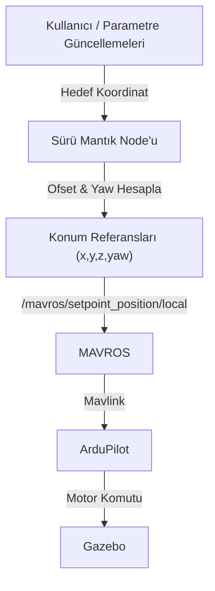

# Çoklu İHA Sürü Kontrol Çalışma Alanı (Multi-Drone Swarm Control)

<p>
  
  
  
  
  
</p>

## 🇬🇧 Overview

A ROS Noetic workspace for leader–follower formation control of three drones with MAVROS, ArduPilot SITL and Gazebo. The swarm layer generates position setpoints instead of raw velocity commands, which keeps the flight controller in charge of the dynamics.

**Quick start:** `roslaunch multi_drone multi_drone_runway.launch`

## 🇹🇷 Proje hakkında

## 1. Genel Bakış

Bu depo, MAVROS, Gazebo ve ArduPilot kullanılarak geliştirilmiş çoklu İHA sürü kontrolü için bir ROS çalışma alanıdır. Proje, Lider-Takipçi (Leader-Follower) mimarisi ve konum referansı (setpoint) tabanlı kontrol kullanarak birden fazla İHA'nın formasyon halinde navigasyonuna odaklanmaktadır.

Basit hız tabanlı uygulamaların aksine, bu çalışma alanı kontrolcü dinamiklerine uygun (controller-aware) akademik bir tasarım kullanır. Sürü katmanı, düşük seviyeli hız komutları yerine dinamik konum referansları (setpoint) üreterek uçuş kontrolcüsü ile çok daha pürüzsüz bir entegrasyon sağlar.

**Mevcut Durum:** 3 İHA'nın üçgen formasyonunda kararlı kontrolü sağlanmıştır.

---

## 2. Sistem Mimarisi

| Katman                                  | Sorumluluk                                                                              |
| --------------------------------------- | --------------------------------------------------------------------------------------- |
| **Sürü Katmanı (Swarm Layer)** | Formasyon geometrisi, koordinasyon mantığı, hedef uzayında çarpışma önleme.     |
| **MAVROS / ArduPilot**            | Stabilizasyon, sapma (yaw) kontrolü, motor karıştırma (mixing), uçuş dinamikleri. |

### Veri Akışı



### 3. Özellikler

Lider-Takipçi Formasyonu: 1. Drone lider olarak hareket eder; 2. ve 3. Drone'lar liderin referans sistemine göre üçgen formasyonunu korur.

Sapma (Yaw) Duyarlı Konumlandırma: Formasyon, liderin yönelimine (heading) göre dinamik olarak döner.

Çarpışma Önleme (Hedef Uzayı): Hedef noktaların çakışmasını önlemek için swarm_position_triangle.py içinde potansiyel alan benzeri (potential field-like) bir itme kuvveti uygulanır.

Çevrimiçi (Online) Kontrol: Hedef noktaları, node'ları yeniden başlatmaya gerek kalmadan ROS parametreleri üzerinden gerçek zamanlı güncellenebilir.

Otomatik Durum Makinesi: Otomatik "arm" etme, mod değiştirme (GUIDED) ve kalkış için hazır scriptler içerir.

### 4. Kurulum ve Ön Gereksinimler

### Gereksinimler

* Ubuntu 20.04
* ROS Noetic
* ArduPilot (SITL) & MAVROS
* Gazebo

Kurulum

```bash
source /opt/ros/noetic/setup.bash

cd ~/multi_drone_control_ws/src
git clone <your-repo-url>

cd ~/multi_drone_control_ws
catkin_make
source devel/setup.bash
```

## 5. Kullanım

#### Adım 1: Simülasyon Dünyasını Başlatın Pist ortamını yükler ve 3 drone oluşturur.

```bash
roslaunch multi_drone multi_drone_runway.launch
```

#### Adım 2: ArduPilot SITL Örneklerini Başlatın Drone'ları kontrol etmek için 3 ayrı ArduCopter SITL örneğini (port 14551, 14552, 14553) başlatır.

```bash
./src/multi_drone/scripts/multi_drone_startsitl.sh
```

#### Adım 3: MAVROS'u ArduPilot'a Bağlayın 3 örnek için de MAVLink bağlantılarını kurar.

```bash
roslaunch multi_drone multi_drone_apm.launch
```

#### Adım 4: Arm ve Kalkış Motorları "arm" eder ve tüm drone'lara 10 metrede asılı kalma (hover) komutu verir.

```bash
rosrun multi_drone multi_drone_takeoff.py
```

#### Adım 5: Sürü Kontrolcüsünü Başlatın Formasyon mantığını etkinleştirir. Drone'lar formasyon noktalarına hareket edecektir.

```bash
rosrun multi_drone swarm_position_triangle.py _leader_goal:="[20.0, 0.0, 6.0]"
```

#### Adım 6: Hedefleri Anlık Güncelleyin Sürüyü hareket ettirmek için, yeni bir terminalde liderin hedef parametresini güncelleyin:

```bash
rosparam set /swarm_position_triangle/leader_goal "[40.0, 10.0, 8.0]"
```

### 6. Çalışma Alanı

multi_drone_control_ws/
├── src/
│   └── multi_drone/
│       ├── launch/
│       │   ├── multi_drone_apm.launch
│       │   └── multi_drone_runway.launch
│       ├── models/
│       └── src/
│           ├── multi_drone_takeoff.py
│           ├── multi_drone_landing.py
│           └── swarm_position_triangle.py

### 7. Referanslar ve İlham Kaynağı

Makale: Hoenig, W., & Ayanian, N. (2017). Distributed Multi-Robot Navigation Using the ROS Framework. ROSCon 2017.

Bu çalışma alanı, makaledeki sanal yapı konseptlerini bir MAVROS ortamına uyarlar.

### 8. Yazar

Ümran Meryem Karabakal Elektrik-Elektronik Mühendisliği Odak Alanları: Robotik, İHA'lar, Sürü Sistemleri, ROS
