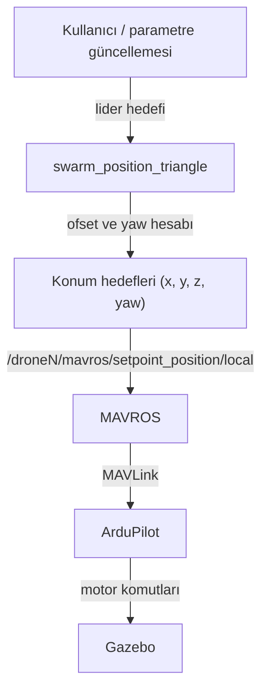

# multi_drone_control_ws

<p>
  
  
  
  
  
</p>

## Overview

A ROS Noetic workspace where three drones fly in a leader–follower triangle formation using Gazebo, ArduPilot SITL
and MAVROS. The formation node sends a position setpoint to each drone instead of raw velocity commands, so
stabilisation and motor control stay with ArduPilot. The leader's goal can be changed while flying.

**Quick start:** `roslaunch multi_drone multi_drone_runway.launch`

## Proje hakkında

Üç drone'un lider–takipçi üçgen formasyonunda uçtuğu bir ROS Noetic çalışma alanı. Gazebo, ArduPilot SITL ve MAVROS
kullanılır. Formasyon düğümü drone'lara doğrudan hız komutu göndermek yerine her birine bir konum hedefi (setpoint)
verir; stabilizasyon ve motor kontrolü ArduPilot'ta kalır. Şu an üç drone üçgen formasyonda kararlı uçuyor.



## Nasıl çalışır

- `drone1` lider. `drone2` ve `drone3`, liderin yönelimine göre döndürülen ofsetlerle üçgenin diğer köşelerinde
  durur, yani formasyon lider döndükçe onunla birlikte döner.
- Hedef noktalar arasında en az `min_dist` mesafe kalması için hedefler birbirinden itilir (potansiyel alana benzer
  basit bir itme).
- Liderin hedefi `~leader_goal` parametresinden her döngüde yeniden okunur; düğüm çalışırken değiştirilebilir.
- Kalkış betiği her drone'u GUIDED moda alır, arm eder ve 10 m'ye kaldırır.

| Parametre | Varsayılan | Açıklama |
|---|---|---|
| `~leader_goal` | `[20.0, 0.0, 6.0]` | liderin hedefi (x, y, z) |
| `~d` | `1.8` | lider ile takipçiler arası mesafe (m) |
| `~min_dist` | `1.2` | hedefler arası en küçük mesafe (m) |
| `~rep_k` | `0.7` | itme katsayısı |
| `~rate_hz` | `20.0` | yayın frekansı |
| `~leader_yaw_mode` | `face_goal` | `face_goal` ya da `hold` |
| `~follower_yaw_mode` | `follow_leader` | `follow_leader` ya da `face_leader_goal` |

## Kurulum

Gereksinimler: Ubuntu 20.04, ROS Noetic, Gazebo, ArduPilot SITL (`~/ardupilot` altında) ve MAVROS.

```bash
source /opt/ros/noetic/setup.bash
git clone https://github.com/umranmeryemkarabakal/multi_drone_control_ws.git ~/multi_drone_control_ws
cd ~/multi_drone_control_ws
catkin_make
source devel/setup.bash
```

## Çalıştırma

```bash
# 1. Gazebo: pist ve üç drone
roslaunch multi_drone multi_drone_runway.launch

# 2. Üç ArduCopter SITL örneği (UDP 14551, 14552, 14553)
./src/multi_drone/scripts/multi_drone_startsitl.sh

# 3. Üç MAVROS bağlantısı (drone1, drone2, drone3 ad alanları)
roslaunch multi_drone multi_drone_apm.launch

# 4. Arm ve 10 m'ye kalkış
rosrun multi_drone multi_drone_takeoff.py

# 5. Formasyon kontrolü
rosrun multi_drone swarm_position_triangle.py _leader_goal:="[20.0, 0.0, 6.0]"

# 6. Uçarken yeni hedef
rosparam set /swarm_position_triangle/leader_goal "[40.0, 10.0, 8.0]"

# İniş
rosrun multi_drone multi_drone_landing.py
```

## Dosya yapısı

```text
multi_drone_control_ws/
└── src/multi_drone/
    ├── launch/
    │   ├── multi_drone_runway.launch        Gazebo dünyası ve üç drone
    │   ├── multi_drone_apm.launch           üç MAVROS örneği
    │   └── multi_drone_takeoff_landing.launch
    ├── models/drone1, drone2, drone3/
    ├── scripts/multi_drone_startsitl.sh     üç SITL örneğini açar
    ├── src/
    │   ├── swarm_position_triangle.py       formasyon kontrolü
    │   ├── multi_drone_takeoff.py
    │   ├── multi_drone_landing.py
    │   ├── multi_drone_go_to_goal.py
    │   └── sleep_node.py
    └── worlds/multi_drone_runway.world
```
